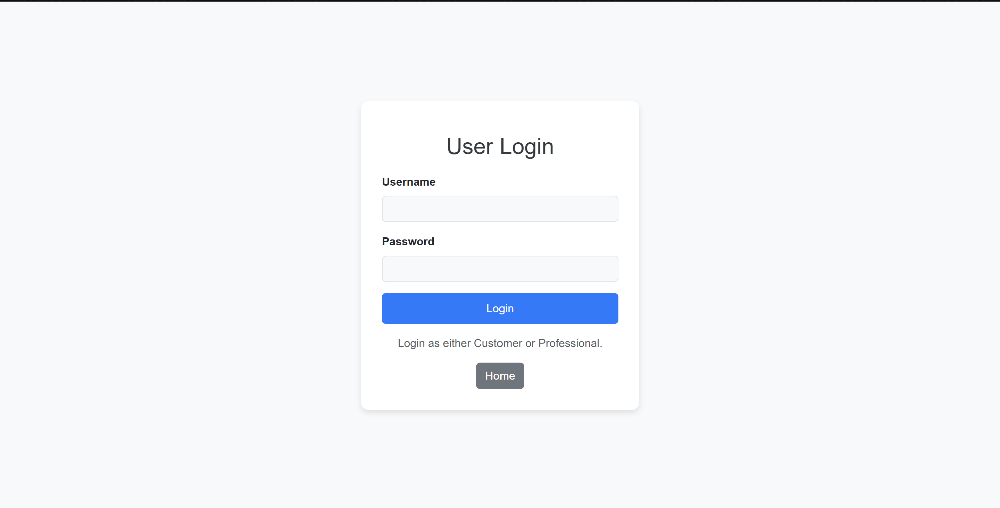
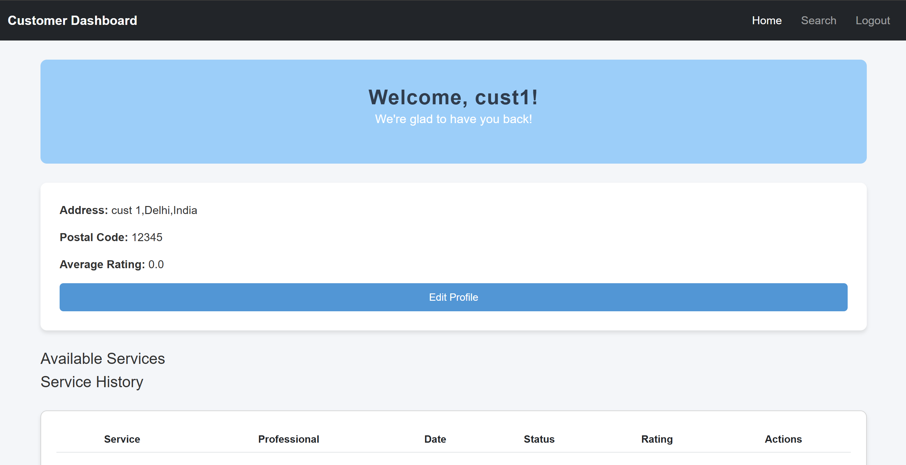
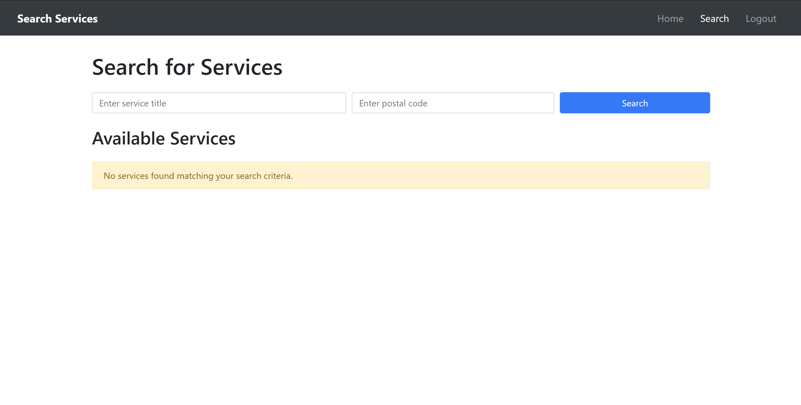
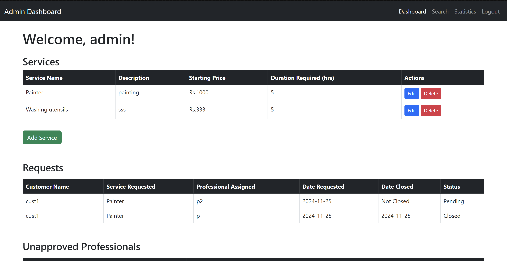
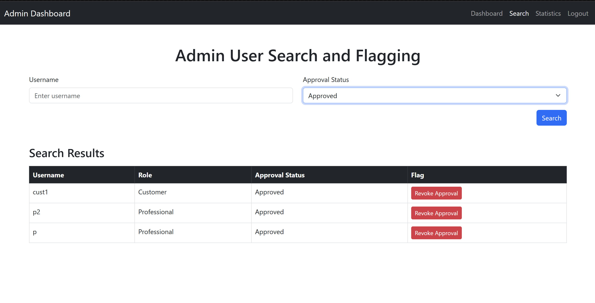
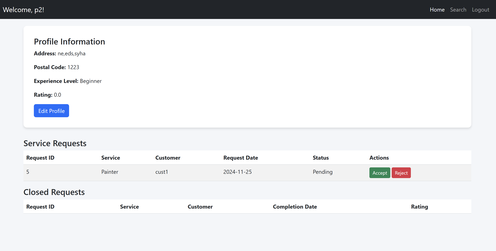

---

# Household Services Application

### **Overview**
A-Z Household Services is a comprehensive multi-user platform that facilitates home servicing and solutions. Designed with a clear role-based structure, it connects administrators, service professionals, and customers on a single platform to streamline service management and delivery.

---

### **Key Features**
1. **Multi-User Access**:
   - **Admin**: Manage services and users, approve professionals, and monitor platform activity.
   - **Service Professionals**: Register and accept/complete customer service requests.
   - **Customers**: Search, book, and review services.

2. **Core Functionalities**:
   - **Admin Dashboard**: Centralized control for managing users, services, and activity.
   - **Service Management**: CRUD operations for services (create, read, update, delete).
   - **Service Requests**:
     - Customers can create, edit, and close service requests.
     - Professionals can accept, reject, and close requests after completion.
   - **Search Services**: Search by name, location, or pin code.
   - **User Actions**: Block/unblock users based on fraudulent activities or poor reviews.

3. **Enhanced UX**:
   - User-friendly UI built using Jinja2 templates and Bootstrap.
   - Form validation with HTML5/JavaScript and backend validation for enhanced security.

4. **APIs**:
   - RESTful API endpoints for seamless interaction between the platform components.
   - Optional data visualization using external libraries like ChartJS.

---

### **Technology Stack**
- **Backend**: Python (Flask)
- **Frontend**: Jinja2 Templates, Bootstrap
- **Database**: SQLite
- **APIs**: Flask RESTful
- **Other Tools**: ChartJS (for visualization)

---

### **Application Roles**
#### **Admin**:
- Access admin dashboard upon login.
- Approve or block users (customers or professionals).
- Manage services: Add, update, or delete.
- Monitor activity and reviews.

#### **Service Professionals**:
- Register and create a profile (subject to admin approval).
- View and respond to service requests.
- Complete and close service tasks.

#### **Customers**:
- Register and log in to access services.
- Create, manage, and close service requests.
- Post reviews for completed services.

---
User Table ↔ Service Table:

A professional can be linked to one service (through service_id).
A service can have multiple professionals.

Service Table ↔ Service Requests Table:

A service request is tied to one service type (through service_id).
A service can have multiple requests associated with it.

User Table ↔ Service Requests Table:

A customer (client_id) can make multiple service requests.
A service request can optionally be assigned to a professional (professional_id).

---

### **Screenshots**
Below are screenshots showcasing the application's interface and features:













---

### **Installation and Usage**

1. **Clone the Repository**:
   ```bash
   git clone <repository-url>
   cd household-services
   ```

2. **Set Up Virtual Environment**:
   ```bash
   python -m venv env
   source env/bin/activate  # Linux/Mac
   env\Scripts\activate     # Windows
   ```

3. **Install Dependencies**:
   ```bash
   pip install -r requirements.txt
   ```

4. **Run the Application**:
   ```bash
   python app.py
   ```

5. **Access the App**:
   Open your browser and navigate to `http://127.0.0.1:5000`.

---

### **Future Enhancements**
- Add real-time notifications for service updates.
- Integrate payment gateway for service transactions.
- Implement AI-based recommendations for services and professionals.

